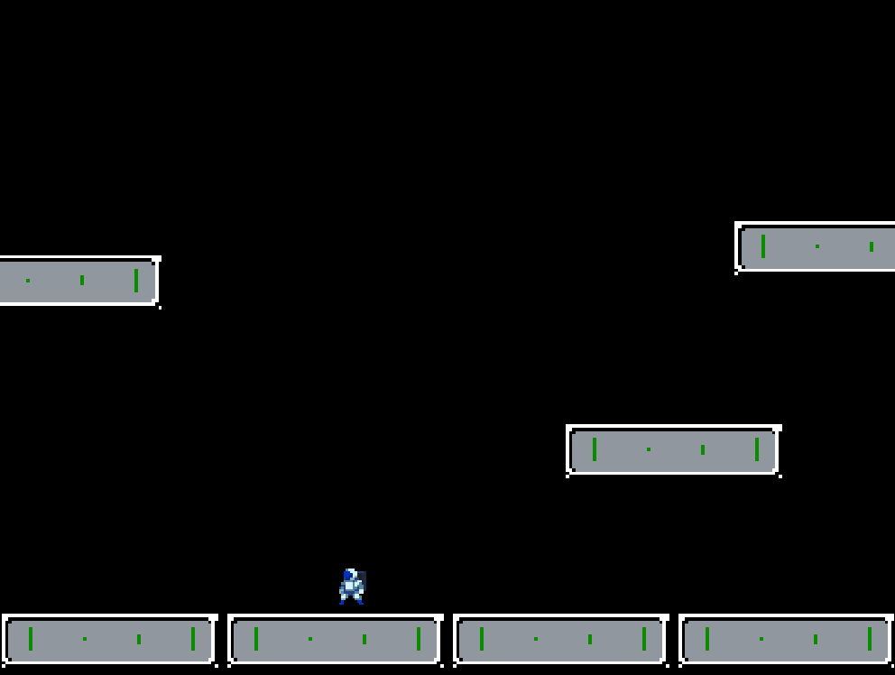

<h1 align='center'>Game</h1>

<h2 align='center'>Sobre</h2>

<h3 align='center'>Meu primeiro jogo com a biblioteca phaser, apenas para aprender a fisica da biblioteca e seus metodos!</h3>

## 🚀 Technologies

<ul>
    <li>Phaser</li>
    <li>TypeScript</li>
    <li>HTML5</li>
    <li>Vite</li>
</ul>
